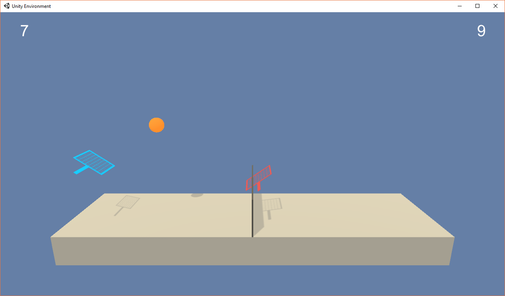

# tennis
This is my solution to Udacity reinforcement learning **collaboration and competition** project. DDPG(Deep Deterministic Policy Gradient) networks are used.
### environment
The environment is provided by Udacity and it is made from the Unity ML agent (https://github.com/Unity-Technologies/ml-agents).
There are 2 agents in this environment. Each agent is a tennis racket that moves horizontally and jumps vertically.
- The environment returns 24 floats as the states for an agent in each step so the environment returns 2 X 24 floats.
- There are two actions available to an agent and the actions are continuous between -1 and 1.
- A reward of +0.1 is provided to an agent for each step if the agent hits the ball over the net.
- If an agent lets a ball hit the ground or hits the ball out of bounds, it receives a reward of -0.01
   
The environment is considered as solved if your agents get an average score of +0.5 over 100 consecutive episodes, after taking the maximum over both agents each episode.


  
### getting started
This project depends on Pytorch and Unity ML agents.
- Pytorch: https://pytorch.org/
- Unity ML agents: https://github.com/Unity-Technologies/ml-agents/blob/master/docs/Installation.md
- Udacity navigation environment: https://github.com/udacity/deep-reinforcement-learning/tree/master/p3_collab-compet

**It is important to note that the agent provided by Udacity is only compatible with Unity ML agent version 0.4.0. It can be downloaded from https://github.com/Unity-Technologies/ml-agents/releases.**

### instructions
A train can be started by running training.py. The path and the executable of the environment should be passed in as the first argument. For example if the environment is Tennis.exe (Windows executable) in the Tennis_Windows_x86_64 directory, you can run the script like this

```
python training.py train Tennis_Windows_x86_64/Tennis.exe
```

The agents can be tested after finishing a training session with

```
python training.py test Tennis_Windows_x86_64/Tennis.exe
```

