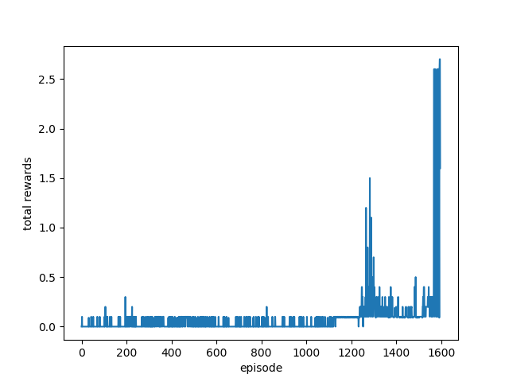

### learning Algorithm
I implemented DDPG (Deep Deterministic Policy Gradient) networks (https://arxiv.org/abs/1509.02971). The implementation is quite similar to the algorithm in the paper but I applied a constant decay (0.999 per episode) to the OU noise to make the learning more stable once it starts converging. The agents share the actor and the critic networks and also share the replay buffer.

The learning agent is created with these parameters:
- num_agents: the number of agents in the environment
- state_size: the number of states
- action_size: the number of actions
- seed: random seed
- buffer_size: maximum number of elements in the replay buffer
- batch_size: mini batch size
- gamma: reward discount rate
- tau: target network update rate. Use 1 if the target network is updated entirely from the local network at once
- lr_actor: actor network learning rate on the Adam optimizer
- lr_critic: critic network learning rate on the Adam optimizer
- critic_weight_decay: critic network L2 weight decay
- update_every: how often we learn the learning step (i.e. 4 means the learning step is executed ever 4 action taken)
- update_num_repeats: how many times to sample the replay buffer and update networks each learning step
- noise_decay: how much we decay the OU noise each step

The entry point of the training is train() function in training.py. The train function takes following parameters:
- agent: the DDPG agent
- num_episodes: the number of episodes to run

### actor network architecture
- 1 fully connected hidden layer with 256 hidden nodes

### critic network architecture
- 3 fully connected hidden layers
- 256 nodes on the first layer
- 256 nodes on the second layer
- 128 on the third layer
- As in the original DDPG paper, the actions are concatenated to the hidden nodes on the first layer before executing the forward pass from the first hidden layer to the second hidden layer.

### hyperparameters
- num_episodes: 2000
- buffer_size: 100000
- batch_size: 512
- gamma: 0.99
- tau: 0.001
- lr_actor: 3e-4
- lr_critic: 3e-4
- update_every: 4
- update_num_repeats: 2
- noise_decay: 0.999

### benchmark
The agent was able to solve the environment  at the episode 1591.

### agents in the testing environment after finishing the training

### future idea
I like to try few other algorithms to solve continuous control problems.
- Distributed Distributional Deterministic Policy Gradients (https://arxiv.org/abs/1804.08617)
- Proximal Policy Optimization (https://arxiv.org/abs/1707.06347)
